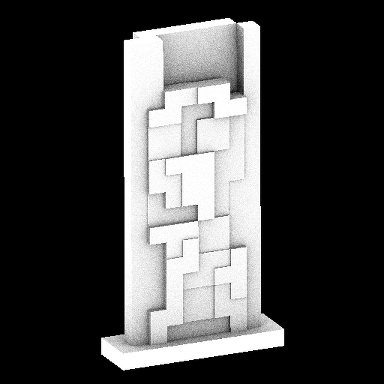
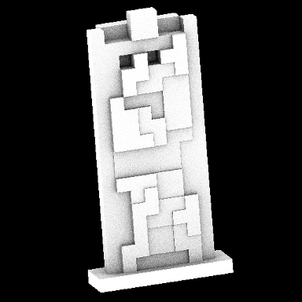

Description
-----------

This is the invitation demo for Chaos Group's CG2 2014 coders competition, part of [CG2 'Code for Art' 2014](http://cg2.chaosgroup.com/conf2014/), which took place on Oct 25th at IEC Sofia. Organized and partially sponsored by Chaos Group Ltd., CG2 is an annual conference event which brings together computer graphics professionals and enthusiasts alike, and offers a tightly-packed program of lectures and presentations from the field. The 2014 coders competition was about [procedurally-generated demoscene-style visual productions](http://cg2.chaosgroup.com/dev-competition/). The invitation demo runs entirely on the CPU (some post-processing done on the GPU), and does Monte-Carlo-based object-space ambient occlusion by tracing rays across dynamic-content (frame-by-frame generated) voxel trees. The version used in the [youtube video](https://www.youtube.com/watch?v=Fs5zvCip2uI) was rendered at non-realtime settings - 1024x1024 resolution, 64 AO rays per pixel. In comparison, the version on the floor machine was configured to run at 768x768 and 24 AO rays, though it never got to run in public due to event schedule overrun. For reference, the stage machine was a 24-core/48-thread Xeon NUMA.

Project Tree
------------

The demo itself is in prob_6; it shares a good deal of code (read: identical headers and translation units) with prob_4, which is a game built using the technology from the demo. Its unofficial name is 'An Occlusion Game Unlike No 0ther', for short - aogun0.

* CL     - OpenCL 1.2 headers from khronos.org
* common - shared code, not specific to any particular project
* prob_4 - aogun0
* prob_6 - CG2 2014 invitation demo
* prob_7 - CG2 2014 invitation demo, OpenCL redux (in progress)

How to Build
------------

Running the build_glx.sh script in the respective directiory builds the resident project.

Build Prerequisites
-------------------

Linux with glibc 2.2.5, glibcxx 3.4.11 and X11; OpenGL 3.1, GLX 1.3

clang++, preferably 3.5, still 3.4 works fine. Older versions might do as well, but have not been tested.

Default build options are set for link-time optimisations (-flto), which require the presence of a gold linker and LLVMGold.so module. To disable this optimisation just comment out -flto from the build script.

Many things are controlled at build time, via macro definitions in the build script. Here are a few defines one might want to adjust:

* WORKFORCE_NUM_THREADS - Number of workforce threads (normally equating the number of logical cores)
* WORKFORCE_THREADS_STICKY - Make workforce threads sticky (NUMA, etc)
* AO_NUM_RAYS - Number of AO rays per pixel

Screengrabs of aogun0
---------------------

 

prob_7 openCL 1.2 benchmark
---------------------------

*'Have raycaster -- will benchmark'* -- [Robert A. Heinlein](https://en.wikipedia.org/wiki/Have_Space_Suit%E2%80%94Will_Travel)

Results from headless build run to the 1000th frame, resolution 3840x2160; on hardware with multiple device types the name of the soc/cpu is given, followed by device in parentheses:

| hardware (device)                | device multiplicity         | device mem, GB/s  | FPS      | remarks                                                                                         |
| -------------------------------- | --------------------------- | ----------------- | -------- | ----------------------------------------------------------------------------------------------- |
| Rockchip RK3399 (mali-t860mp4)   |   1x mali-t860              | 12.8              | 0.849    | ARM Mali-T860 OpenCL 1.2 v1.r14p0-01rel0-git(966ed26).f44c85cb3d2ceb87e8be88e7592755c3, 800 MHz |
| Rockchip RK3399 (cortex-a72)     |   2x cortex-a72             | 12.8              | 0.379    | pocl 1.3, llvm 8.0.0, OCL_KERNEL_TARGET_CPU: cortex-a72, 1800 MHz                               |
| Amlogic S922X (mali-g52mp6)      |   1x mali-g52               | 10.56             | 0.982    | ARM Mali-G52 OpenCL 2.0 git.c8adbf9.122c9daed32dbba4b3056f41a2f23c58, 750 MHz                   |
| Amlogic S922X (cortex-a73)       |   4x cortex-a73             | 10.56             | 0.763    | pocl 1.3, llvm 8.0.0, OCL_KERNEL_TARGET_CPU: cortex-a73, 1800 MHz                               |
| Marvell ARMADA 8040 (cortex-a72) |   4x cortex-a72             | 19.2              | 0.824    | pocl 1.3, llvm 8.0.0, OCL_KERNEL_TARGET_CPU: cortex-a72, 2000 MHz                               |
| AWS Graviton (cortex-a72)        |  16x cortex-a72             | 19.2              | 3.639    | pocl 1.3, llvm 8.0.0, OCL_KERNEL_TARGET_CPU: cortex-a72, 2290 MHz                               |
| NXP LX2160A (cortex-a72)         |  16x cortex-a72             | 19.2              | 3.200    | pocl 1.3, llvm 8.0.0, OCL_KERNEL_TARGET_CPU: cortex-a72, 2000 MHz                               |
| Intel Xeon E5-2687W (snb), 2S    |  16x sandy bridge (32x SMT) | 51.2 (25.6 1S)    | 2.330    | Intel(R) Corporation, Intel(R) Xeon(R) CPU, OpenCL 1.2 (Build 67279), 3100 MHz                  |
| Intel Xeon E5-2687W (gf108gl)    |   1x gf108gl                | 25.6              | 3.325    | NVIDIA Corporation Quadro 600 OpenCL 1.1 CUDA 375.66, 1280 MHz                                  |
| Intel Xeon E3-1270v2 (gk208b)    |   1x gk208b                 | 40                | 3.670    | NVIDIA Corporation GeForce GT 720 OpenCL 1.1 CUDA 340.102, 797 MHz                              |
| Intel Xeon E3-1270v2 (gt218)     |   1x gt218                  | 9.6               | 0.612    | NVIDIA Corporation GeForce 210 OpenCL 1.1 CUDA 340.102, 1230 MHz                                |
| Intel P8600 (mcp89)              |   1x mcp89                  | 8.53              | 1.427    | NVIDIA GeForce 320M OpenCL 1.0 10.2.37 310.90.10.05b54, CLI: -use_images, 950 MHz               |

Same as above but from branch `better_cpu` and `pocl` patched for good-codegen `convert_T` function:

| hardware (device)                | device multiplicity         | device mem, GB/s  | FPS      | remarks                                                                                         |
| -------------------------------- | --------------------------- | ----------------- | -------- | ----------------------------------------------------------------------------------------------- |
| Rockchip RK3399 (cortex-a72)     |   2x cortex-a72             | 12.8              | 0.410    | pocl 1.3, llvm 8.0.0, OCL_KERNEL_TARGET_CPU: cortex-a72, 1800 MHz                               |
| Amlogic S922X (cortex-a73)       |   4x cortex-a73             | 10.56             | 0.819    | pocl 1.3, llvm 8.0.0, OCL_KERNEL_TARGET_CPU: cortex-a73, 1800 MHz                               |
| Marvell ARMADA 8040 (cortex-a72) |   4x cortex-a72             | 19.2              | 0.912    | pocl 1.3, llvm 8.0.0, OCL_KERNEL_TARGET_CPU: cortex-a72, 2000 MHz                               |
| AWS Graviton (cortex-a72)        |  16x cortex-a72             | 19.2              | 4.049    | pocl 1.3, llvm 8.0.0, OCL_KERNEL_TARGET_CPU: cortex-a72, 2290 MHz                               |
| NXP LX2160A (cortex-a72)         |  16x cortex-a72             | 19.2              | 3.546    | pocl 1.3, llvm 8.0.0, OCL_KERNEL_TARGET_CPU: cortex-a72, 2000 MHz                               |
